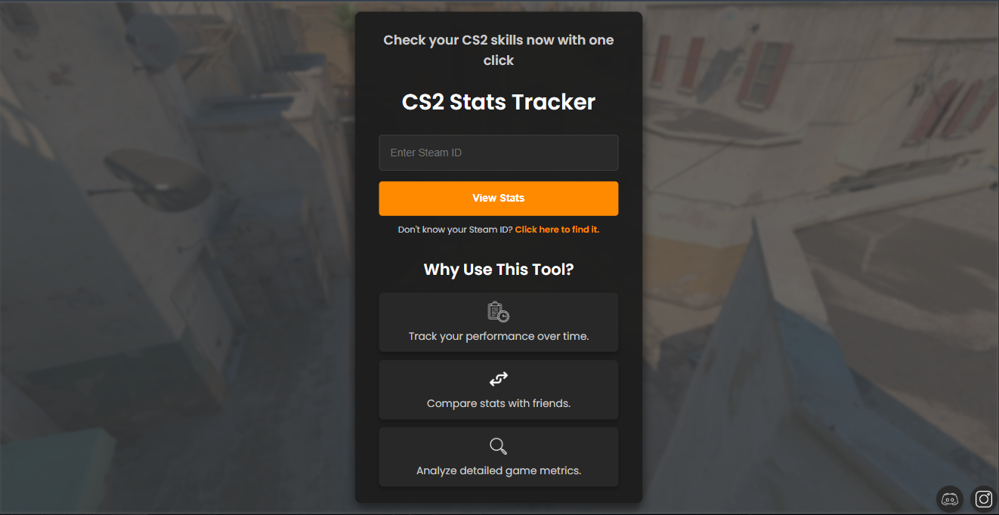
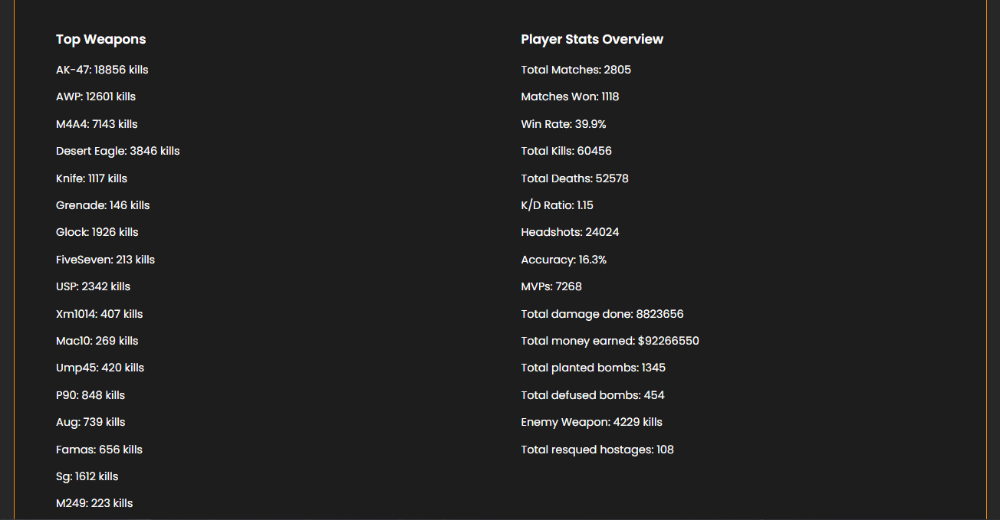
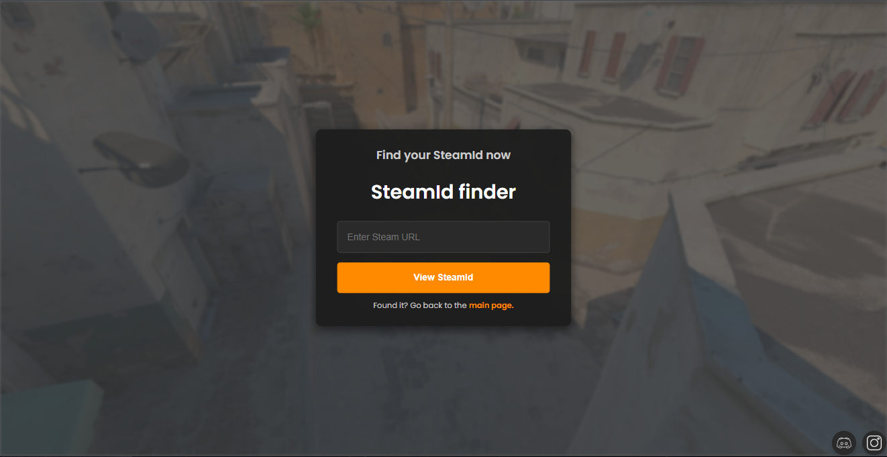

# CS2 Stats Tracker

A modern web application that provides detailed Counter-Strike 2 statistics for any Steam player. Simply enter your Steam ID or profile URL to view comprehensive stats about your CS2 gameplay.

## 🎮 Features

- **Steam ID Lookup Tool**: Easily find your Steam ID from your profile URL
- **Detailed Player Statistics**: View your complete CS2 performance metrics
- **Weapon Analysis**: See your proficiency with different weapons
- **Map Performance**: Track your win rates on different maps
- **Achievement Tracking**: Monitor your CS2 achievements
- **Recent Activity**: Check your recent playtime and performance
- **Stat Comparison**: Add your friend's Steam Id and see who has better stats.

## 🛠️ Built With

- Node.js
- Express.js
- Steam Web API
- HTML/CSS/JavaScript
- Hosted on Render

## 🌐 Live Demo

[Visit CS2 Stats Tracker](https://cs2-stats.onrender.com)

## 📸 Screenshots





## Local mode
1. Clone the repository
2. **npm install** the dependencies
3. Create a **.env** file containing:
```
STEAM_API_KEY=your_steam_api_key
PORT=3000
```
4. **npm start** the server
5. Open your browser and navigate to `http://localhost:3000`.

## 👤 Author

**Rares Racasan**

- Discord: [tricksswg](https://discordapp.com/users/553950676246331412)
- Instagram: [@raresracsan](https://www.instagram.com/raresracsan/)
